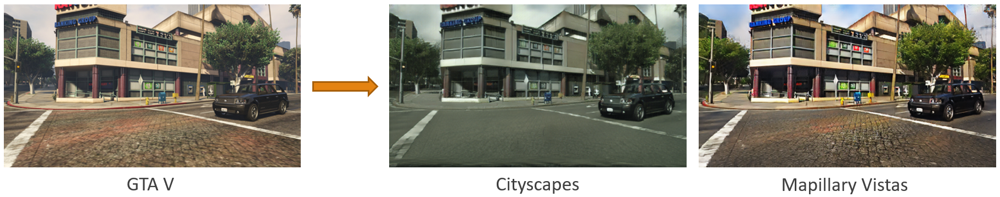
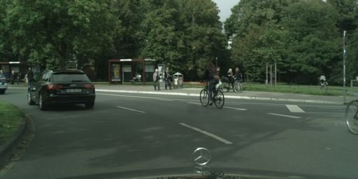
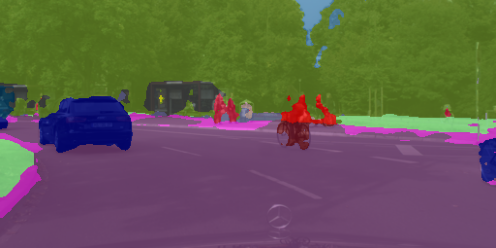

# GTA V Image-to-Image Translation
You can find my thesis in English [here](https://dspace.lib.ntua.gr/xmlui/handle/123456789/54709?locale-attribute=en).

This project aims to transform GTA V images so that they have the style of two different real-world datasets. The image-to-image translation models used for that purpose are [CycleGAN](https://github.com/junyanz/pytorch-CycleGAN-and-pix2pix), [AttentionGAN](https://github.com/Ha0Tang/AttentionGAN), [CUT](https://github.com/taesungp/contrastive-unpaired-translation), and [DCLGAN](https://github.com/JunlinHan/DCLGAN). Additionally, the translated results are evaluated using common GAN metrics such as IS, FID, and KID, as well as through the performance in semantic segmentation using DeepLabv3+. The inspiration comes from [CyCADA](https://arxiv.org/pdf/1711.03213.pdf) and [Enhancing photorealism enhancement](http://vladlen.info/papers/EPE.pdf).

Translation example using CycleGAN:


Semantic segmentation example of DeepLabv3+ trained with CycleGAN's translated images from GTA V to Cityscapes:
<p float="left">
  
   
</p>

The following is a simple guide to prepare the data and perform image-to-image translation. I use CycleGAN as an example because it produces the best results, but the process is very similar for the other models.


## 1. Download datasets
[Cityscapes](https://www.cityscapes-dataset.com/): Download and extract 'leftImg8bit_trainvaltest.zip' to 'datasets/cityscapes_fine' and 'leftImg8bit_trainextra.zip' to 'datasets/cityscapes_extra'. For semantic segmentation you should also download and extract 'gtFine_trainvaltest.zip' to 'datasets/cityscapes_fine'.
```
/datasets
    /cityscapes_extra
        /leftImg8bit
    /cityscapes_fine
        /gtFine
        /leftImg8bit
```

[Mapillary Vistas](https://www.mapillary.com/dataset/vistas?lat=20&lng=0&z=1.5&pKey=301072681638536): Instead of Cityscapes you can use Mapillary Vistas. Download and extract 'mapillary-vistas-dataset_public_v2.0.zip' to 'datasets/mapillary'.
```
/datasets
    /mapillary
    	/testing
	/training
        /validation
```

[GTA V](http://download.visinf.tu-darmstadt.de/data/from_games/): Download and extract all 10 parts of the images to 'datasets/gtav'. For image-to-image translation only the images are needed, but for semantic segmentation you should also download the labels separately. 
```
/datasets
    /gtav
        /images
	/labels
```

## 2. Prepare data

- To prepare images for GTA V to Cityscapes translation run:
```
python prepare_cityscapes.py --cityscapes_extra ./datasets/cityscapes_extra/leftImg8bit --cityscapes_fine ./datasets/cityscapes_fine/leftImg8bit --output_dir ./datasets/gtav2cityscapes
```

```
python prepare_gtav.py --images_dir ./datasets/gtav/images --split ./datasets/split.mat --output_dir ./datasets/gtav2cityscapes
```

You should get:
```
/datasets
    /gtav2cityscapes
	/testA
	/testB
	/trainA
	/trainB
```


- To prepare images for GTA V to Mapillary Vistas translation run:
```
python prepare_mapillary.py --images_dir ./datasets/mapillary --output_dir ./datasets/gtav2mapillary
```

```
python prepare_gtav.py --images_dir ./datasets/gtav/images --split ./datasets/split.mat --output_dir ./datasets/gtav2mapillary
```

You should get:
```
/datasets
    /gtav2mapillary
	/testA
	/testB
	/trainA
	/trainB
```


## 3. Image-to-image translation using CycleGAN
- First clone [CycleGAN](https://github.com/junyanz/pytorch-CycleGAN-and-pix2pix). 
- To view progress during training run `python -m visdom.server` and click the URL <http://localhost:8097>. You could also disable visdom by setting `--display_id 0`.
  
- To train CycleGAN to translate GTA V images to Cityscapes run:
```
python train.py --dataroot [path to datasets/gtav2cityscapes] --name gtav2cityscapes --model cycle_gan --preprocess 'crop' --save_epoch_freq 2 --n_epochs 30
```
The `--dataroot` path should be something like 'D:/Users/User/PycharmProjects/GTAV-image-to-image-translation/datasets/gtav2cityscapes'. In the case of Mapillary Vistas replace 'gtav2cityscapes' with 'gtav2mapillary'. The checkpoints, as well as intermediate results, will be saved in the 'checkpoints' directory.

- To test CycleGAN rename the checkpoint '30_net_G_A.pth' (the number corresponds to the epoch) to '30_net_G.pth' and run:
```
python test.py --dataroot [path to datasets/gtav2cityscapes/testA] --name gtav2cityscapes --model test --no_dropout --preprocess 'none' --epoch 30
```
The translated images will be saved in the 'results' directory. By default, CycleGAN generates 50 images. To translate all GTA V test images set `--num_test 6181`.


## 4. Evaluation

- To calculate IS, FID, and KID for the translated images I used [torch-fidelity](https://github.com/toshas/torch-fidelity). If you want to calculate only FID, you could also use [pytorch-fid](https://github.com/mseitzer/pytorch-fid). I tested both, and the results are almost the same.
First, install torch-fidelity:
```
pip install torch-fidelity
```
Then run:
```
fidelity --gpu 0 --isc --fid --kid --kid-subset-size 500 --input1 [path to translated GTA V images] --input2 [path to datasets/gtav2cityscapes/testB]
```
- For semantic segmentation, I used [this](https://github.com/VainF/DeepLabV3Plus-Pytorch) PyTorch implementation of DeepLabv3+ with some changes (data preprocessing/loading) to work with my data.
